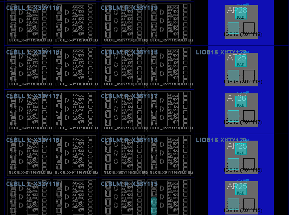

# FIFO device views

These Vivado screenshots show the FPGA device layout and highlighted resource sites. They complement the [FIFO schematic](fifo-schematic.png). The captures alone do not establish timing closure or successful implementation.

## Device overview

## Resource detail

The close-up includes CLB/slice resources and I/O sites. Exact design-cell assignments should be checked in Vivado's Properties panel. FPGA part and design stage were not supplied with these captures.
