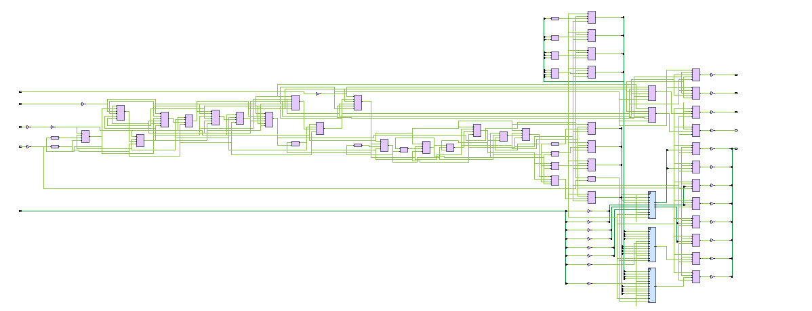
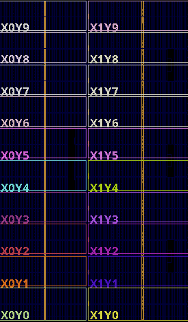
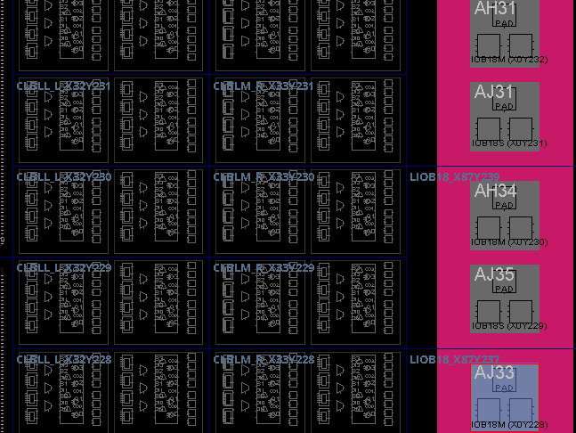

# Schematic and FPGA device views

[Back to README](../README.md) · [Design explanation](design.md) · [Simulation evidence](simulation.md)

## FIFO schematic

This capture shows the logic and connectivity generated by Vivado. Use the original tool view to inspect cell names and signal details; the image alone does not provide a resource-utilization report.

## Device overview

The device view shows the FPGA's physical resource grid and clock-region labels such as X0Y2. These labels describe regions of the chip, not FIFO entries or addresses.

## Resource detail

The close-up includes CLB/slice resources and I/O sites. Colors and highlighted sites depend on the current Vivado selection and display settings. Exact cell-to-site assignments should be checked in the tool's Properties panel.

## What these captures establish

They document the project's Vivado design-exploration workflow. The target part, Vivado version, saved design stage, utilization report, and timing report are not included in this repository.

Do not interpret these images as evidence of successful placement and routing, timing closure, a generated bitstream, or operation on an FPGA board. Behavioral verification is documented separately in the [simulation guide](simulation.md).
