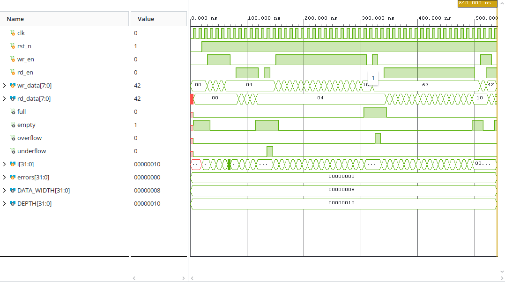

# Simulation and verification

[Back to README](../README.md) · [Design explanation](design.md)

## Vivado setup

The project uses Vivado's XSim workflow. No Icarus installation is required.

1. Create an RTL project and choose your actual target FPGA part or board.
2. Add `rtl/sync_fifo.v` under Design Sources and select `sync_fifo` as the design top.
3. Add `tb/sync_fifo_tb.v` under Simulation Sources and select `sync_fifo_tb` as the simulation top.
4. Launch Run Behavioral Simulation and run until the testbench reaches `$finish`.
5. Check every failure message and the final `All tests passed` result.

The design top is for synthesis; the testbench top supplies the clock, reset, and stimulus during behavioral simulation. Simulating the unconnected DUT alone can produce undriven inputs and unknown outputs.

For the tool workflow, see AMD's [Vivado Logic Simulation guide (UG900)](https://docs.amd.com/r/en-US/ug900-vivado-logic-simulation).

## Testbench structure

The testbench uses a 10 ns clock period. This is a simulated stimulus setting, not proof that the implemented design meets 100 MHz timing.

Inputs are changed on falling edges, accepted by the DUT on rising edges, and checked after a 1 ns delay to allow register updates to settle. Case-inequality comparisons (`!==`) detect unknown and high-impedance values as failures. Each failed check increments `errors`; a summary is printed before simulation finishes.

The testbench ends normally even on a failed check, so a simulator process exiting successfully is not itself a PASS. Read the error count and console summary.

## Directed cases

| Case | Stimulus | Checks |
|---|---|---|
| Reset | Hold active-low reset across two rising edges | Empty, not full, output and error flags cleared |
| Normal traffic | Write 1–4, then read four times | Ordered data; empty only after last read |
| Underflow | Request one more read while empty | Read rejected; last result (4) held; underflow asserted |
| Underflow recovery | Remove read request | Underflow clears at the next rising edge |
| Fill | Write 1–16 without reading | Full asserted only after the sixteenth write |
| Overflow | Attempt to write 99 while full | Write rejected; full stays high; overflow asserted; output held |
| Overflow recovery | Remove write request | Overflow clears at the next rising edge |
| Drain | Read all sixteen entries | Data remains 1–16, showing rejected write did not corrupt the sequence |
| Simultaneous traffic | Store 55; read it while writing 66 | Result 55; queue remains nonempty; no errors |
| Replacement read | Read the remaining entry | Result 66; queue becomes empty |

The fill/drain sequence crosses circular-pointer wrap. This exercises wrap in the demonstrated depth-16 configuration, but is not a stress test across many rounds or depths.

## Waveform

The supplied capture shows `errors = 0` at the end of the sequence. It supports the demonstrated directed-test result; it is not a formal proof or a timing report. The image is the user's saved Vivado run, not a newly rerun simulation during repository cleanup.

The capture uses hexadecimal display:

| Displayed value | Decimal value | Context |
|---|---:|---|
| `10` | 16 | Final fill/drain value and FIFO depth |
| `63` | 99 | Rejected write while full |
| `37` | 55 | First item used for simultaneous traffic |
| `42` | 66 | Replacement item, also the final read result |

Watch `full` assert after filling, `overflow` during the rejected write, `underflow` during the rejected empty read, and `empty` after the final accepted reads.

## Viewing and saving waves

Add the testbench clock, reset, enables, data, status flags, and `errors` to the Wave window. Internal DUT pointers and count are useful optional debug signals. Restart and rerun if you need to capture signals from time zero; zoom to fit the full run.

Vivado manages its generated waveform database (`.wdb`) within the project simulation output. A saved waveform configuration (`.wcfg`) records the viewer arrangement, not the underlying simulation data. Portfolio screenshots live in `docs/images/`.

The existing `$dumpfile` and `$dumpvars` statements are retained from the learner's testbench for optional VCD export. They are not the basis of the Vivado waveform-viewing workflow.

## Remaining verification

Not covered by this testbench:

- Simultaneous read/write at the full and empty boundaries.
- Reset while data is queued, and a dedicated between-edge synchronous-reset check.
- Randomized traffic, repeated wrap stress, and long-duration testing.
- Width/depth sweeps, including depth 1 and non-power-of-two depths.
- Automated failure exit status, assertions, or coverage measurement.
- Post-implementation timing simulation or FPGA-board testing.

Changing parameters alone does not make this testbench generic: it writes four entries initially, expects not-full in that sequence, and uses 8-bit constants and integer expected values. Adjust stimulus and expected-value widths before testing other configurations.
